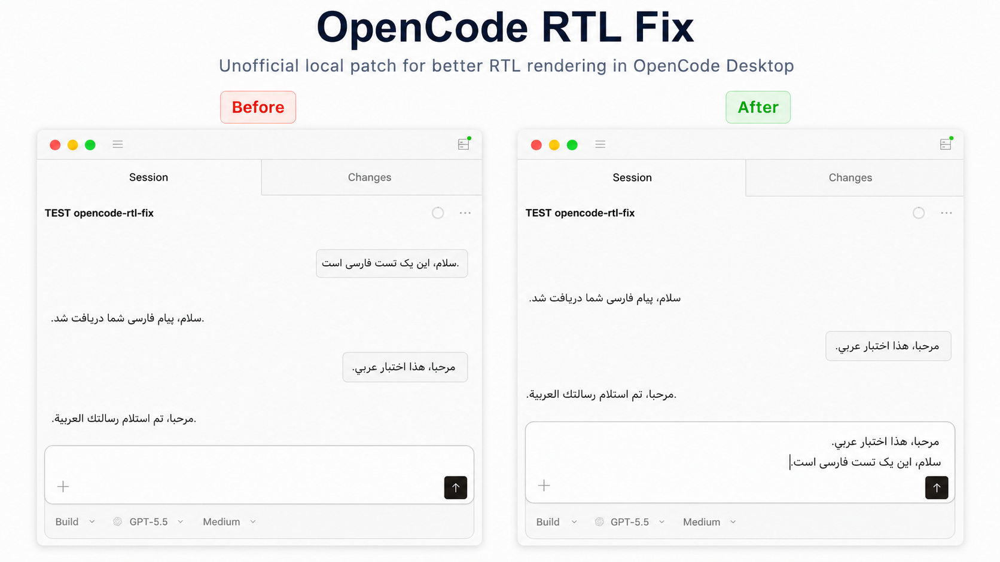

# OpenCode RTL Fix

Fix broken RTL text rendering in OpenCode Desktop.

Languages: [فارسی](./README.fa.md) | [العربية](./README.ar.md)



Unofficial local patch for OpenCode Desktop on macOS and Windows.

This patch improves Persian, Arabic, and RTL text rendering in:

- User messages
- Assistant messages
- Markdown paragraphs and lists
- Blockquotes
- Code blocks containing RTL text

It also applies a more readable font for Persian and Arabic characters.

## Trust and scope

This project does not collect data, does not send analytics, and does not modify user projects. It only patches the installed OpenCode Desktop app.asar file and creates a local backup.

OpenCode is a separate project and is not affiliated with this repository. This license only applies to the patch scripts and files in this repository.

## Requirements

- macOS or Windows
- OpenCode Desktop installed
- Node.js available in PATH
- Internet access for the first run, because the script uses `npx @electron/asar`

## Install

Download the latest release ZIP and extract it.

### macOS

Double-click:

```text
macos/patch.command
```

Or run from Terminal:

```bash
./macos/patch.command
```

If OpenCode is installed somewhere else:

```bash
OPENCODE_APP="/path/to/OpenCode.app" ./macos/patch.command
```

### Windows

Open PowerShell and run:

```powershell
powershell -ExecutionPolicy Bypass -File .\windows\patch.ps1
```

If OpenCode is installed somewhere else:

```powershell
powershell -ExecutionPolicy Bypass -File .\windows\patch.ps1 -AsarPath "C:\Path\To\OpenCode\resources\app.asar"
```

You can also pass the OpenCode install directory instead of the exact `app.asar` path.

After patching, fully quit and reopen OpenCode.

## Restore

### macOS

Double-click:

```text
macos/unpatch.command
```

Or run:

```bash
./macos/unpatch.command
```

### Windows

Run:

```powershell
powershell -ExecutionPolicy Bypass -File .\windows\unpatch.ps1
```

The patch creates a backup next to `app.asar` before modifying it.

## Test

Send this message in OpenCode:

```text
سلام، این یک تست فارسی است.
```

Arabic test message:

```text
مرحبا، هذا اختبار عربي.
```

Expected result:

- Persian and Arabic text is right-aligned and RTL.
- Punctuation appears at the correct visual end of the sentence.
- English text, paths, and normal code remain LTR.

## Support this project

If this patch helped you, you can support the project with a small crypto donation.

USDT (TRC20): `TF2SffSgmxF2bybzLZMDRZYnmuG6HwywQZ`

USDC (Base): `0xBab66d7b78099Fb3A53e5556236358612d7a150c`

GRAM (TON Network): `UQDr6SiRznhjlngE-NQ0aLoNLTb_gsV0KENakOYJ-CUVJKUy`

## Notes

- This modifies the installed OpenCode Desktop `app.asar` file.
- OpenCode updates can overwrite the patch. Run the patch again after updates.
- This is an unofficial patch and is not affiliated with the OpenCode team.
